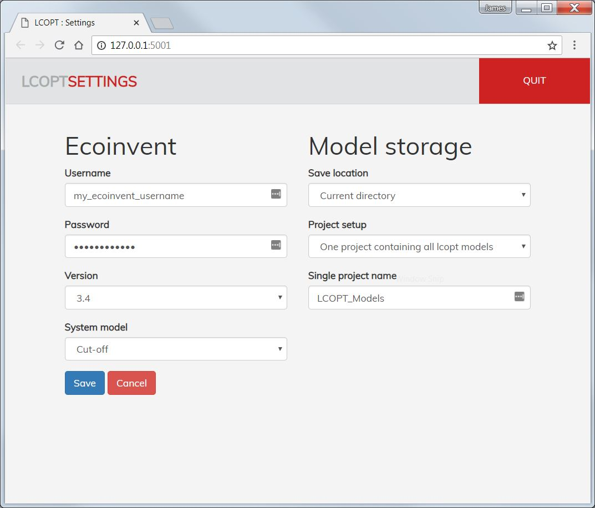

# lcopt-dev
Development branch for the interactive tool for creating fully parameterised Life Cycle Assessment (LCA) foreground models (lcopt)

| 	Platform		| Status 		|
|---------------|---------------|
| Unix     		|  [](https://travis-ci.org/pjamesjoyce/lcopt) |
| Windows  		|  [](https://ci.appveyor.com/project/pjamesjoyce/lcopt/branch/development)   |
| Test coverage | [](https://coveralls.io/github/pjamesjoyce/lcopt?branch=development) |
|Citation | [](http://joss.theoj.org/papers/c0b544bee185c9ac75e96d24b8573547)|

Lcopt is a python module for creating fully parameterised LCA foreground models using a Flask based interactive GUI developed by [James Joyce](https://pjamesjoyce.github.io/)

It integrates directly with BrightWay2, and can export models to SimaPro

You can export and share your model and results as an .lcoptview file, and share them with a wider audience using [lcoptview](http://lcoptview.rtfd.io)

Online documentation, including full installation instructions, is available [here](http://lcopt.readthedocs.io)

## Installation

### Development installation

Lcopt is continuing to develop, with new features and extensions being added. The `lcopt-dev` conda package is updated each time an update is pushed to the [`development` branch on github](https://github.com/pjamesjoyce/lcopt/tree/development).

It's recommended that you create a new environment separate from the one with `lcopt` in to install `lcopt-dev`, as they will overwrite one another.

Create a dev environment like this

```
conda create -y -n lcopt-dev -c conda-forge -c cmutel -c haasad -c pjamesjoyce lcopt-dev
```

Or to get the most up to date version of `lcopt-dev`:

```
activate lcopt-dev
conda update -c conda-forge -c cmutel -c haasad -c pjamesjoyce lcopt-dev
```

### Linking lcopt to brightway

`lcopt-dev` makes this easy, by using the excellent [`eidl`](https://github.com/haasad/EcoInventDownLoader) developed by [Adrian Haas](https://github.com/haasad).

Lcopt-dev can create models using external LCI data from any version of the [ecoinvent database](http://www.ecoinvent.org/database/ecoinvent-33/ecoinvent-33.html) (ecoinvent license required) or the [FORWAST database](http://forwast.brgm.fr/)

If you have an ecoinvent login, open up the command line/console and type:

```
lcopt-settings
```

This will launch the settings page in your web browser. Enter your username and password, and choose your preferred version of ecoinvent. Click save.



The first time you create a model, lcopt will automatically download and set up the ecoinvent database in brightway - just be patient as it takes a while. This only needs to happen once though.

If you don't have an ecoinvent login, leave this blank and lcopt will automatically download and use FORWAST instead.

## Using lcopt (Easy)

Below are the basic commands to get lcopt's interactive GUI up and running to create your first model. A [Getting Started](https://lcopt.readthedocs.io/en/latest/2_Getting_Started.html) guide, including a [video runthrough](https://lcopt.readthedocs.io/en/latest/2_Getting_Started.html#video), as well as [more detailed instructions](https://lcopt.readthedocs.io/en/latest/3_use.html) are available in the [online documentation](https://lcopt.readthedocs.io/).

To launch lcopt and view an example model, at the command line use:

```
lcopt-launcher
```

Lcopt is written in Python, so you can also use it from within a Python shell. Open up a jupyter notebook or python shell and use the following commands:

## Using Lcopt from the python shell/Jupyter notebooks (Recommended)

To import lcopt use: 

```python
from lcopt import *
```

### Creating a new model

To create a model, you need to create an instance of the LcoptModel class using the model name as the first argument:

```python
model = LcoptModel('My First Model')
```

By default the model will be populated in the background with the details to link to the version of ecoinvent you specify in settings. If you want your model to use a dirfferent version or system model you can specify this using:


```python
model = LcoptModel('My First Ecoinvent 3.4 APOS Model', ecoinvent_version="3.4", ecoinvent_system_model="apos")
```

Or if you want to use FORWAST instead use:

```python
model = LcoptModel('My First FORWAST Model', useForwast=True)
```

### Loading an existing model

Lcopt saves models in your local APPDATA directory by default. In windows this is C:\Users\[your_name]\AppData\Local\Lcopt\Lcopt.

You can optionally tell lcopt to save models in your current directory using `lcopt-settings`

To load a model, use the model name (with or without the .lcopt extension) or the full file path (if it's not in the current directory or defualt directory), in this command:

```python
model = LcoptModel(load='My First Model')
```

Note : If you accidentally forget to use `load=` and you see a blank model don't panic. Lcopt won't overwrite your saved model unless you tell it to. Simply don't save the model and re-run the command with `load=`

### Launching the GUI

To launch the GUI for your model simply call the `launch_interact` method of your newly created model instance:

```python
model.launch_interact()
```

This will start a Flask server and launch your web browser to access the GUI. If it doesn't or you accidentally close the GUI tab, simply go to [http://127.0.0.1:5000/](http://127.0.0.1:5000/).

Information on how to use the GUI is located in 'More info...' panels dotted around at sensible locations within it.

For more details on using it, see the [documentation](https://lcopt.readthedocs.io/en/latest/3_use.html) or the [video](https://lcopt.readthedocs.io/en/latest/2_Getting_Started.html#video)

## Contribute

If you have any problems, questions, comments, feature requests etc. please [raise an issue here on github](https://github.com/pjamesjoyce/lcopt/issues)

If you want to contribute to Lcopt, you're more than welcome! Please fork the [github repository](https://github.com/pjamesjoyce/lcopt/) and open a pull request. 

Lcopt uses [py.test](https://docs.pytest.org/en/latest/index.html>) and Travis for automated testing, so please accompany any new features with corresponding tests. See the `tests` folder in the [source code](https://github.com/pjamesjoyce/lcopt/tree/master/tests) for examples.  

## Cite

Lcopt has been published in the [Journal of Open Source Software](http://joss.theoj.org/papers/10.21105/joss.00339).

[](http://joss.theoj.org/papers/c0b544bee185c9ac75e96d24b8573547)

You can download the citation in BibTeX for use in LaTeX or importing into [Mendeley](https://www.mendeley.com/)/other reference management software from [here](http://www.doi2bib.org/#/doi/10.21105/joss.00339).

Or use the following citation:

Joyce, P.J., 2017. Lcopt - An interactive tool for creating fully parameterised Life Cycle Assessment (LCA) foreground models. Journal of Open Source Software, 2:16. doi:10.21105/joss.00339

## Thanks

Thanks to [Adrian Haas](https://github.com/haasad) for contributing to the ongoing development of lcopt!